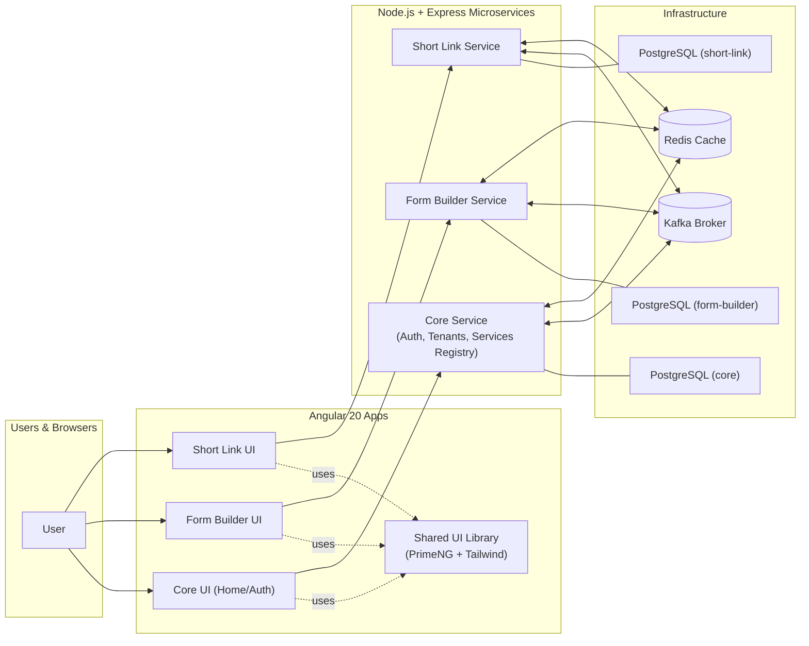
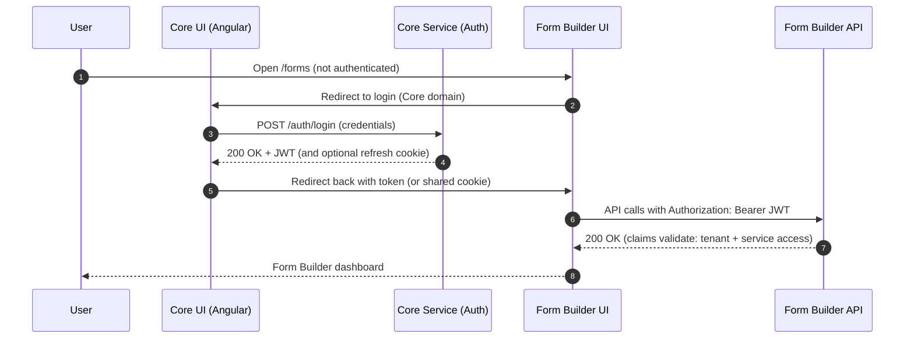
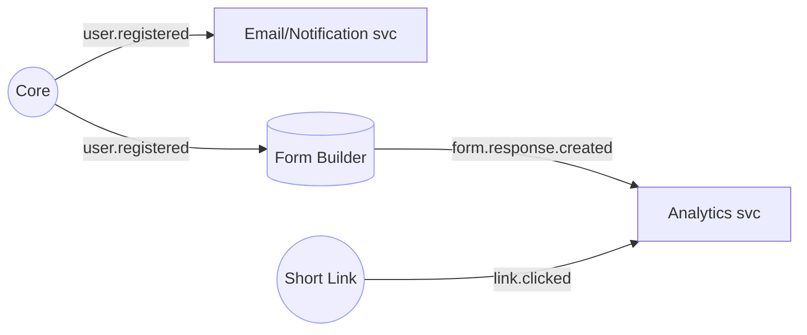
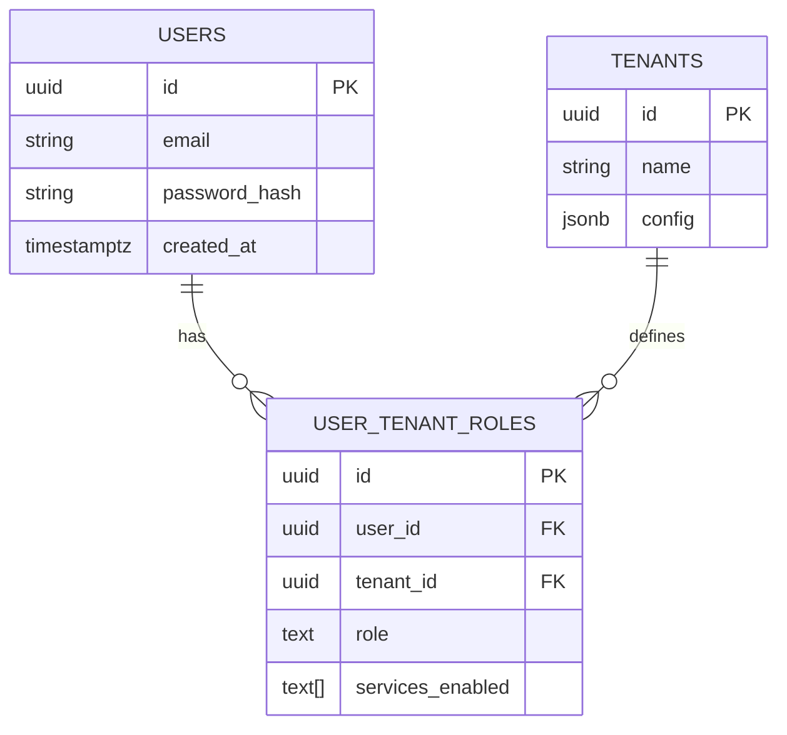
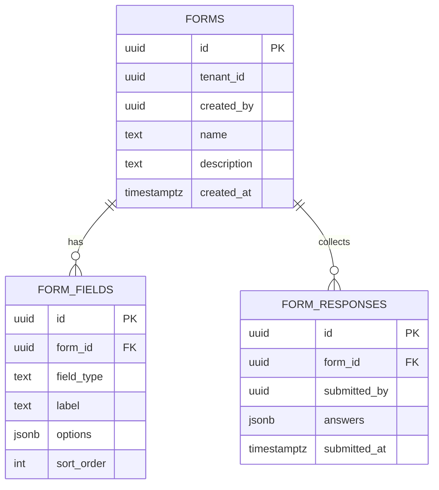
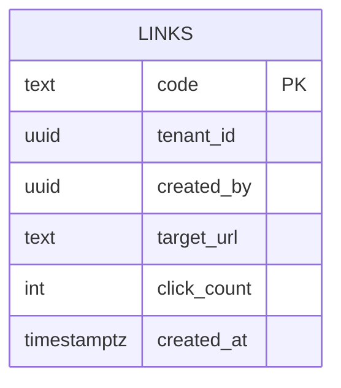
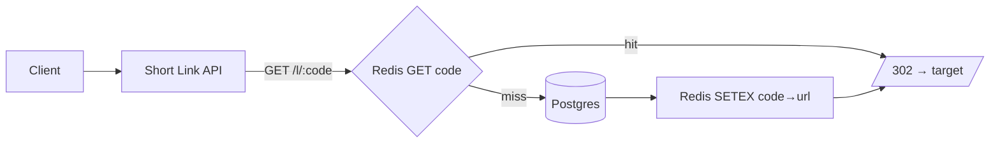
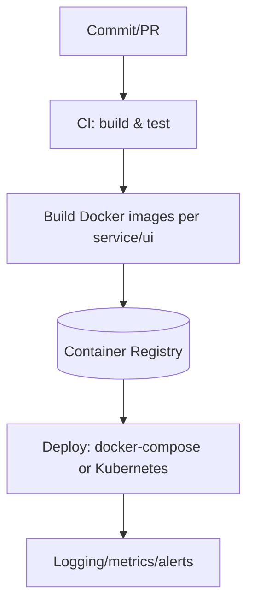

# Microservices Architecture Blueprint and Roadmap

This document consolidates the uploaded blueprint into a developer-friendly Markdown and adds visual **Mermaid** diagrams to explain how the system should work end-to-end.

---

## Overview

- **Backend:** Node.js + Express microservices (independently deployable), each with its own Postgres database/schema.
- **Frontend:** Angular 20 apps per service (Core, Form Builder, Short Link), with a **Shared UI Library** (PrimeNG + Tailwind).
- **Auth:** JWT-based SSO issued by **Core** and trusted by all services.
- **Messaging:** **Kafka** for events; **Redis** for caching/rate limits/locks.
- **Tenancy:** Single-tenant and multi-tenant modes; evolve from shared tables with `tenant_id` to schema-per-tenant or DB-per-tenant.
- **Ops:** CI/CD, Docker-ready (and optional Kubernetes), with simple non-Docker local dev.

---

## High-Level System Context


---

## JWT SSO Login Flow (Sequence)



**Notes**
- Stateless access tokens; consider short TTL + refresh token (httpOnly) for UX.
- Each service verifies signature + required claims (e.g., `services` includes `form_builder`, `tenant` enforced in queries).

---

## Service Responsibilities

### Core Service
- Auth (/login, /logout, optional /refresh, /register)
- Tenants, users, roles, service access matrix
- Optional Services registry endpoint (`GET /services`) for UI cards
- Emits/consumes events (e.g., `user.registered`)

### Form Builder Service
- CRUD for forms, fields, responses
- Tenant-scoped data
- Emits events: `form.created`, `form.response.created`
- Optional caching of form definitions in Redis

### Short Link Service
- Create/manage short URLs; public redirect endpoint `/l/:code`
- Heavy Redis caching for code→target lookup
- Emits `link.created`, `link.clicked`

---

## Event-Driven Interactions (Kafka)


*Consumers can be added/removed independently; services remain loosely coupled.*

---

## Multi‑Tenancy Options

```mermaid
graph TD
    A[Start simple: Shared Tables<br/>tenant_id on every row] --> B[Schema-per-tenant (Postgres schemas)]
    B --> C[Database-per-tenant (strongest isolation)]
```
**Enforcement**
- Read/write always filtered by `tenant` claim from JWT.
- Consider ORM middleware/scopes and composite unique keys per tenant.

---

## Data Model Starters (Illustrative)







---

## Caching & Rate Limiting (Redis)


- Token blacklists / allowlists (optional)
- Login throttling keys (`ip:login`)

---

## CI/CD & Deployment


**Local Dev**
- Run Postgres, Kafka, Redis (Docker ok), services with `npm run dev`, Angular with `ng serve` + proxy.

**Production**
- One domain with reverse-proxy routing (`/core-api`, `/form-api`, `/shortlink-api`, static UIs)
- Secrets via env vars; HTTPS everywhere.

---

## Add a New Service (Playbook)

```mermaid
flowchart LR
    A[Scaffold Node/Express + Angular app] --> B[Add DB schema + JWT middleware]
    B --> C[Define service-id & update Core claims issuance]
    C --> D[Wire Kafka topics (produce/consume)]
    D --> E[Add to Docker/Compose/K8s + CI/CD]
    E --> F[Expose UI link in Core dashboard]
```
Checklist:
- `tenant_id` on every table (or schema/DB per tenant)
- JWT `services` claim enforcement
- Topic names convention `{service}.{event}`
- Shared UI library for consistent UX

---

## Security Notes
- Hash passwords (bcrypt/argon2); secure cookies for refresh tokens.
- Validate inputs; strict CORS; same-site cookies where applicable.
- Short token TTL + refresh rotation; consider JTI blacklist for revocation.
- Per-tenant RBAC; audit events via Kafka or logs.

---

## Roadmap (Milestones)

1. **Scaffold repos + Nx/monorepo (optional).**
2. **Core auth + tenants + JWT issuance.**
3. **Core UI with login & services dashboard.**
4. **Form Builder API + UI (basic CRUD).**
5. **Short Link API + UI; Redis cache on redirect.**
6. **Kafka events across services; simple consumer.**
7. **Dockerfiles + docker-compose; basic CI.**
8. **Multi-tenant hardening + RBAC.**
9. **Reverse proxy + HTTPS + secrets mgmt.**
10. **Monitoring + analytics + docs.**

---

*End of document.*
