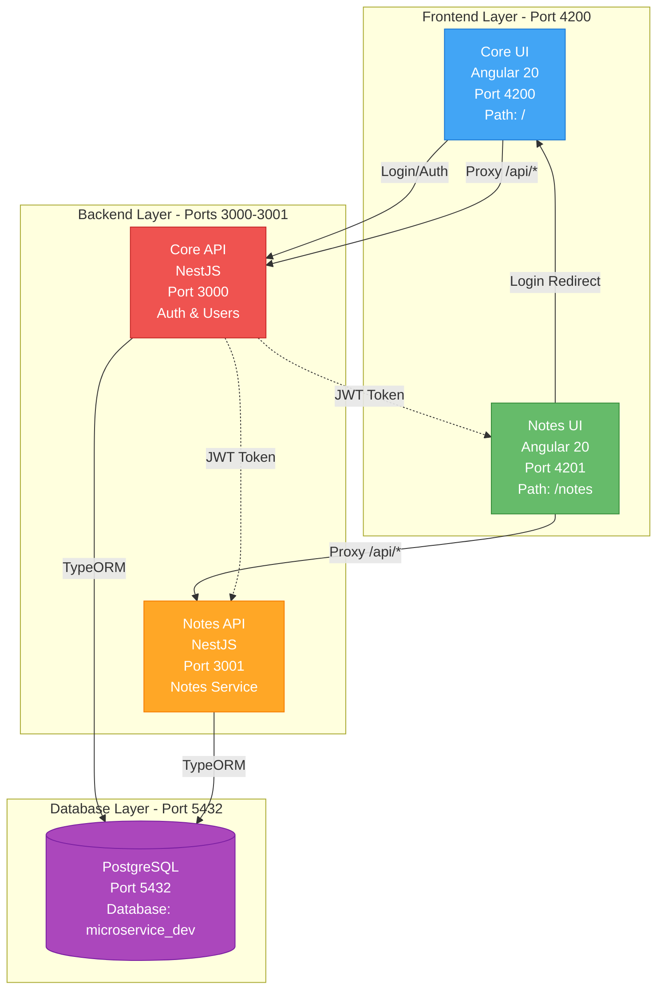
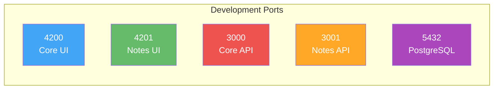
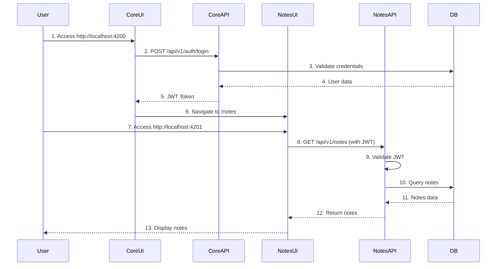
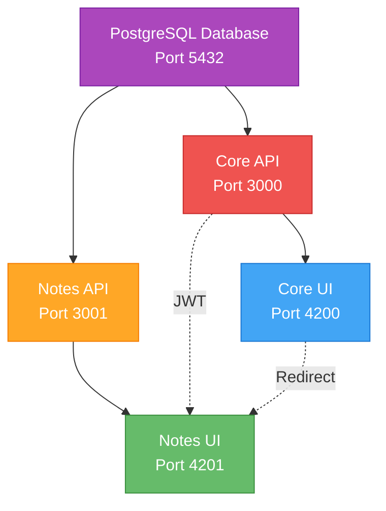
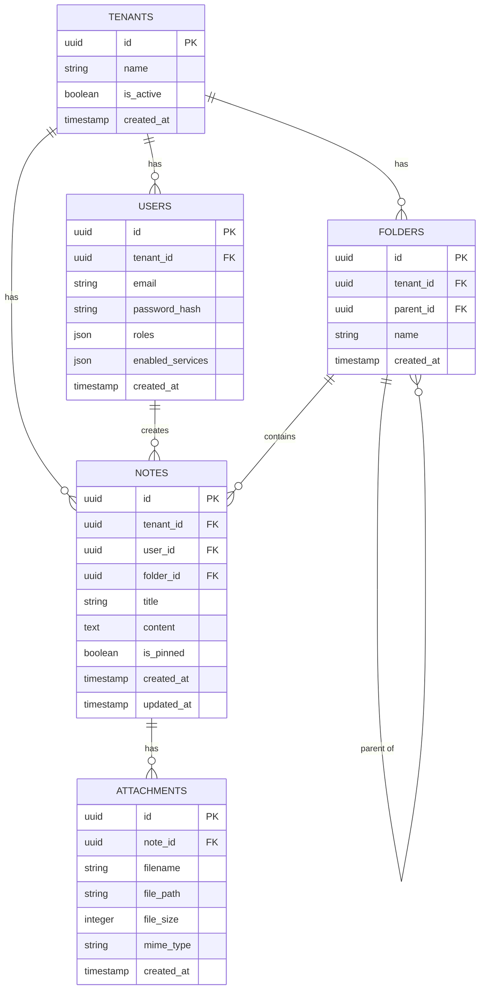

# Services Architecture - Ports & Environment Configuration

## System Architecture Overview



## Port Allocation



| Service | Port | URL | Purpose |
|---------|------|-----|---------|
| **Core UI** | 4200 | http://localhost:4200 | Main frontend - Login, Dashboard |
| **Notes UI** | 4201 | http://localhost:4201 | Notes frontend - Note management |
| **Core API** | 3000 | http://localhost:3000 | Backend - Auth, Users, Tenants |
| **Notes API** | 3001 | http://localhost:3001 | Backend - Notes, Folders, Attachments |
| **PostgreSQL** | 5432 | localhost:5432 | Database |

## Request Flow Diagram



## Environment Configurations

### Core API (Port 3000)

**File:** `apps/core-api/.env`

```bash
# Server Configuration
NODE_ENV=development
PORT=3000

# Database Configuration
DB_HOST=localhost
DB_PORT=5432
DB_USERNAME=postgres
DB_PASSWORD=postgres
DB_DATABASE=microservice_dev

# JWT Configuration
JWT_SECRET=your-super-secret-jwt-key-change-in-production
JWT_EXPIRES_IN=24h

# CORS Configuration (comma-separated for multiple origins)
CORS_ORIGIN=http://localhost:4200,http://localhost:4201

# Service URLs
CORE_UI_URL=http://localhost:4200
NOTES_UI_URL=http://localhost:4201
NOTES_API_URL=http://localhost:3001

# Logging
LOG_LEVEL=debug
```

---

### Core UI (Port 4200)

**File:** `apps/core-ui/src/environments/environment.ts`

```typescript
export const environment = {
  production: false,
  apiUrl: 'http://localhost:3000', // Core API
  notesApiUrl: 'http://localhost:3001', // Notes API
  notesUiUrl: 'http://localhost:4201' // Notes UI (for redirects)
};
```

**File:** `apps/core-ui/proxy.conf.json`

```json
{
  "/api": {
    "target": "http://localhost:3000",
    "secure": false,
    "changeOrigin": true,
    "logLevel": "debug"
  }
}
```

**Start Command:**
```bash
cd apps/core-ui
npm run dev  # Runs on port 4200 with proxy
```

---

### Notes API (Port 3001)

**File:** `apps/notes-api/.env`

```bash
# Server Configuration
NODE_ENV=development
PORT=3001

# Database Configuration
DB_HOST=localhost
DB_PORT=5432
DB_USERNAME=postgres
DB_PASSWORD=postgres
DB_DATABASE=microservice_dev

# JWT Configuration (must match Core API)
JWT_SECRET=your-super-secret-jwt-key-change-in-production

# CORS Configuration (comma-separated for multiple origins)
CORS_ORIGIN=http://localhost:4200,http://localhost:4201

# Service URLs
CORE_API_URL=http://localhost:3000
CORE_UI_URL=http://localhost:4200
NOTES_UI_URL=http://localhost:4201

# File Upload Configuration
MAX_FILE_SIZE=10485760  # 10MB in bytes
UPLOAD_PATH=./uploads

# Logging
LOG_LEVEL=debug
```

---

### Notes UI (Port 4201)

**File:** `apps/notes-ui/src/environments/environment.ts`

```typescript
export const environment = {
  production: false,
  apiUrl: 'http://localhost:3001', // Notes API
  coreApiUrl: 'http://localhost:3000', // Core API (for login redirect)
  coreUiUrl: 'http://localhost:4200' // Core UI (for redirects)
};
```

**File:** `apps/notes-ui/proxy.conf.json`

```json
{
  "/api": {
    "target": "http://localhost:3001",
    "secure": false,
    "changeOrigin": true,
    "logLevel": "debug"
  }
}
```

**Start Command:**
```bash
cd apps/notes-ui
npm run dev  # Runs on port 4201 with proxy
```

---

## Service Dependencies



**Startup Order:**
1. PostgreSQL (Port 5432)
2. Core API (Port 3000)
3. Notes API (Port 3001)
4. Core UI (Port 4200)
5. Notes UI (Port 4201)

## Quick Start Commands

```bash
# 1. Start PostgreSQL (if not running)
# Make sure PostgreSQL is running on port 5432

# 2. Start Core API
cd apps/core-api
npm run start:dev  # Port 3000

# 3. Start Notes API
cd apps/notes-api
npm run start:dev  # Port 3001

# 4. Start Core UI (in new terminal)
cd apps/core-ui
npm run dev  # Port 4200

# 5. Start Notes UI (in new terminal)
cd apps/notes-ui
npm run dev  # Port 4201
```

## API Endpoints Overview

```mermaid
graph LR
    subgraph "Core API - :3000/api/v1"
        Auth[/auth/login<br/>/auth/register]
        Users[/users<br/>/users/:id]
        Tenants[/tenants<br/>/tenants/:id]
    end

    subgraph "Notes API - :3001/api/v1"
        Notes[/notes<br/>/notes/:id<br/>/notes/search]
        Folders[/folders<br/>/folders/:id]
        Attachments[/notes/:id/attachments]
    end

    style Auth fill:#ffeb3b,stroke:#f57f17
    style Users fill:#ffeb3b,stroke:#f57f17
    style Tenants fill:#ffeb3b,stroke:#f57f17
    style Notes fill:#81c784,stroke:#388e3c
    style Folders fill:#81c784,stroke:#388e3c
    style Attachments fill:#81c784,stroke:#388e3c
```

### Core API Endpoints (Port 3000)

| Method | Endpoint | Description |
|--------|----------|-------------|
| POST | `/api/v1/auth/login` | User login |
| POST | `/api/v1/auth/register` | User registration |
| GET | `/api/v1/users` | Get all users |
| GET | `/api/v1/users/:id` | Get user by ID |
| GET | `/api/v1/tenants` | Get all tenants |
| POST | `/api/v1/tenants` | Create tenant |

### Notes API Endpoints (Port 3001)

| Method | Endpoint | Description |
|--------|----------|-------------|
| GET | `/api/v1/notes` | Get all notes |
| GET | `/api/v1/notes/:id` | Get note by ID |
| POST | `/api/v1/notes` | Create note |
| PATCH | `/api/v1/notes/:id` | Update note |
| DELETE | `/api/v1/notes/:id` | Delete note |
| GET | `/api/v1/notes/search?q=query` | Search notes |
| GET | `/api/v1/folders` | Get all folders |
| POST | `/api/v1/folders` | Create folder |
| POST | `/api/v1/notes/:id/attachments` | Upload attachment |
| DELETE | `/api/v1/notes/:noteId/attachments/:attachmentId` | Delete attachment |

## Database Configuration

**Database:** `microservice_dev`
**Port:** `5432`
**User:** `postgres`
**Password:** `postgres`

### Database Schema



## Development URLs

| Service | Development URL | Purpose |
|---------|----------------|---------|
| **Core UI** | http://localhost:4200 | Main application login |
| **Notes UI** | http://localhost:4201 | Notes management interface |
| **Core API** | http://localhost:3000/api/v1 | Core API endpoints |
| **Notes API** | http://localhost:3001/api/v1 | Notes API endpoints |
| **API Docs (Core)** | http://localhost:3000/api | Swagger documentation |
| **API Docs (Notes)** | http://localhost:3001/api | Swagger documentation |

## Troubleshooting

### Port Already in Use

```bash
# Check what's using a port
lsof -i :4200  # or :4201, :3000, :3001

# Kill process on port
kill -9 <PID>

# Or use npm script (if available)
npm run kill-port 4200
```

### CORS Errors

- Ensure backend CORS_ORIGIN includes frontend URLs
- Restart both frontend and backend after changes
- Check proxy.conf.json is properly configured

### Database Connection Issues

```bash
# Check PostgreSQL is running
pg_isready -h localhost -p 5432

# Test connection
psql -h localhost -p 5432 -U postgres -d microservice_dev
```

### Proxy Not Working

- Ensure using `npm run dev` (which includes --proxy-config)
- Check proxy.conf.json exists in app root
- Verify environment.ts uses empty string for apiUrl
- Restart dev server after proxy changes

---

**Last Updated:** 2025-11-02
**Maintained By:** Development Team
