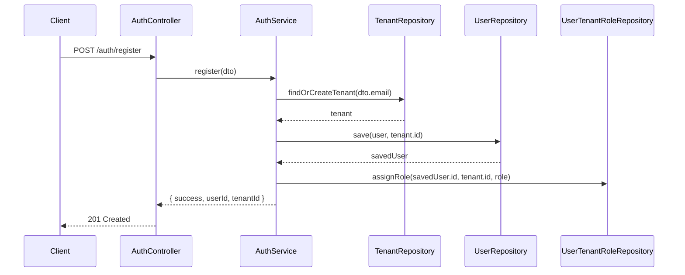

# Stories 1.1–1.7 Implementation Audit
**Date:** 2025-10-29  
**Auditor:** Codex (GPT-5)

## Executive Summary
- Core API functionality for registration, login, password reset, tenant management, and health checks is largely in place, but supporting tooling (build, test, lint) is unstable.
- Angular workspace crashes during turbo orchestrated builds/tests, preventing the monorepo pipelines required by Story 1.1 from succeeding.
- Linting the NestJS workspace fails because of lingering `any` usage and unused variables in the health checks and e2e suites, blocking CI adoption.
- Password reset emails are still console logs; the acceptance criteria that require an integrated email provider remain unmet.
- Deployment documentation and walkthrough steps contain mismatches (e.g., undocumented `tenantId` field, missing `/auth/profile` endpoint) that will mislead users performing manual validation.

## Story Compliance Snapshot
| Story | Status | Notes |
|-------|--------|-------|
| 1.1 Initialize Turborepo | ⚠️ Partial | Structure and scripts exist, but `npm run build/test/lint` break due to Angular crashes and ESLint errors. |
| 1.2 JWT SSO POC | ✅ Meets | Auth/resource services and Angular demo operate; ADR-003 documents HS256 decision. |
| 1.3 TypeORM Tenant Scoping POC | ✅ Meets | `@microservice/auth-utils` houses the reusable pattern and is consumed by the POC. |
| 1.4 Core Auth Service | ✅ Meets | Registration/login flows hash credentials, mint 24h JWTs, enforce duplicate email prevention, and return tenant context. |
| 1.5 Password Reset Flow | ⚠️ Partial | Tokens are issued, secured, and invalidated, but outbound email is not integrated with a provider. |
| 1.6 Tenant Management | ✅ Meets | Auto-tenant creation, admin role assignment, and secured GET/PATCH endpoints implemented. |
| 1.7 Health & Deployment | ⚠️ Partial | Endpoints, Docker assets, and docs exist, yet docs reference nonexistent routes and pipelines fail, undermining readiness. |

## Key Findings
### Build, Test, and Lint Instability
- `npm run build` and `npm run test` abort because the Angular 20 build invoked by Turbo exits with “external process killed a task,” even when `sass-embedded` is present. This blocks the monorepo-wide automation promised in Story 1.1.
- `npm run lint` fails on `@microservice/core-api` with 30+ ESLint errors stemming from unused variables and `any`-typed Jest expectations (see `apps/core-api/src/health/health.controller.ts` and `apps/core-api/test/app.e2e-spec.ts`). Tooling acceptance criteria for Stories 1.1 and 1.7 therefore remain unmet.

### Password Reset Email Integration Gap
- `EmailService.sendPasswordResetEmail` (`apps/core-api/src/common/services/email.service.ts`) still logs to stdout instead of invoking SendGrid or SES, so users never receive real reset links. Story 1.5 acceptance criterion 3 (“Email sent to user with reset link”) fails.

### Documentation Drift
- `docs/deployment/local-setup.md` instructs registrants to send a `tenantId` field and references `GET /auth/profile`, neither of which exist (`apps/core-api/src/auth/dto/register.dto.ts` rejects extra fields; no profile controller). This misleads manual testers and indicates Story 1.7 documentation is inaccurate.

### Library Integration Watch-outs
- `TenantContextMiddleware` in `@microservice/auth-utils` still expects the `x-tenant-id` header instead of leveraging JWT-derived context, so production services will need additional work before adopting it.
- POC auth service skips password verification (bcrypt compare) in favour of hardcoded users. Acceptable for a POC but should be documented as a limitation when sharing learnings.

## Mermaid Diagrams
### Core Registration Flow


### Password Reset Flow
```mermaid
flowchart TD
    A[User submits email to /auth/forgot-password] --> B[AuthService.lookupUser]
    B -->|User not found| C[Return generic success]
    B -->|User found| D[Generate crypto token]
    D --> E[Hash token and store with 1h expiry]
    E --> F[EmailService.send reset link]
    F --> G[User opens reset link]
    G --> H[/auth/reset-password verifies hash & expiry]
    H -->|Valid| I[Hash new password & update user]
    I --> J[Delete reset token]
    H -->|Invalid/Expired| K[Return 400 error & delete token if expired]
```

## Visual Testing Walkthrough
1. **Prepare Environment**  
   - Copy `apps/core-api/.env.example` to `.env`, set `JWT_SECRET`, `FRONTEND_URL`, and database connection string.  
   - Start backing services with `docker-compose up -d` (PostgreSQL + Core API).
2. **Validate Health Endpoints**  
   - Visit `http://localhost:3001/health` for liveness and `http://localhost:3001/ready` for readiness (expect 200 responses).
3. **Register First Tenant Admin**  
   - In Swagger (`http://localhost:3001/api/docs`), execute `POST /auth/register` with email/password/firstName/lastName; omit `tenantId`.
   - Confirm response includes `userId` and `tenantId`.
4. **Login and Capture JWT**  
   - Execute `POST /auth/login` with the same credentials; note the `access_token`.  
   - Decode the token (e.g., [jwt.io](https://jwt.io)) to verify `tenantId`, `roles`, and 24h `exp`.
5. **Exercise Tenant Endpoints**  
   - Call `GET /tenants/{tenantId}` with the JWT (Authorization Bearer header) and confirm tenant details.  
   - Update the tenant name via `PATCH /tenants/{tenantId}` as admin and verify the persisted change.
6. **Execute Password Reset Flow**  
   - Trigger `POST /auth/forgot-password` with the registered email; inspect server logs for the reset link (pending real email integration).  
   - Use the logged token in `POST /auth/reset-password` with a new strong password and ensure the response indicates success.
7. **Run Automated Suites**  
   - From repo root run `npm run build`, `npm run test`, and `npm run lint`. Document any failures (see Findings above) and capture logs for remediation tickets.

## Recommendations
- Stabilise the Angular build so Turbo pipelines succeed, or temporarily exclude the workspace until the crash (`Signal 6`) is resolved.
- Address ESLint violations in the Core API workspace and tighten Jest typings to eliminate the flood of `any` warnings.
- Replace the placeholder email logger with a SendGrid or SES integration and add environment validation to fail fast when credentials are missing.
- Refresh `docs/deployment/local-setup.md` to reflect the actual request/response payloads and available endpoints, preventing tester confusion.
- Update `@microservice/auth-utils` middleware to accept the authenticated user’s tenant from JWT context to ease production adoption.
